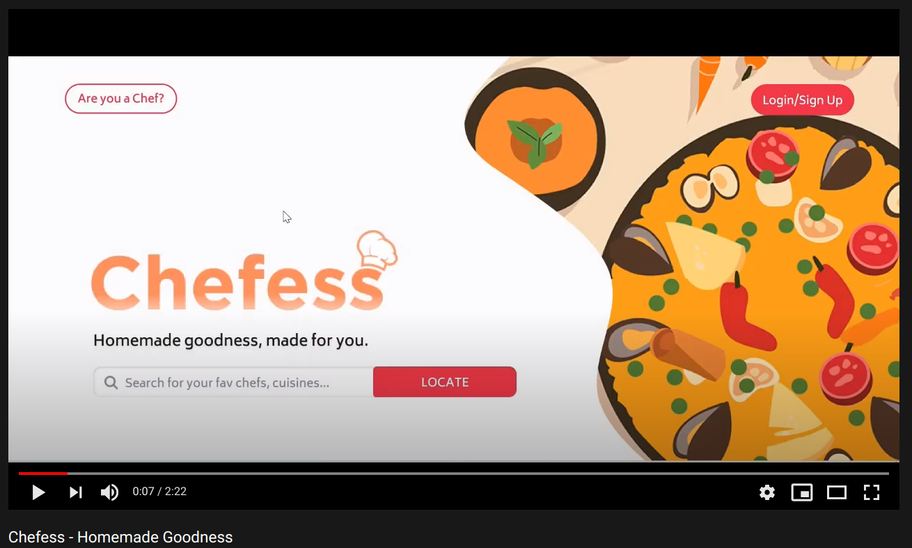

 
 

<a href="https://www.figma.com/proto/nRPjGkYzP2YxYfMV5bBHcB/Chefess?node-id=7%3A2&scaling=min-zoom"> Prototype</a>  |  <a href="https://chefess.herokuapp.com/">Live site</a>

 

The power to spread joy and love through food. Good food only tastes good, but great food makes you feel good. And great food is what Chefess promises to deliver.

## Tech Stack

- MongoDB 🔢
- React ⚛️
- Express ⚙
- Node 🚂
- Figma (for UX design) 🖌

## Features

- Oauth with Google
- Locate chefs near you
